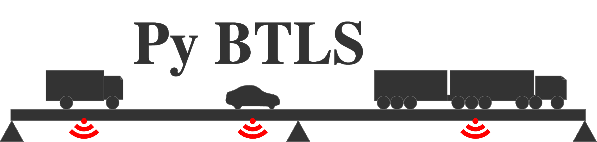

**********************************************
PyBTLS - Python Bridge Traffic Load Simulation
**********************************************

*PyBTLS* is a Python wrapper of the C++ based program bridge traffic load simulation (BTLS). 
It is tailored for traffic simulations on short-to-medium length bridges, 
where vehicles' lane-changing behaviors are considered negligible.

*PyBTLS* uses influence lines or surfaces to calculate the load effects on bridges. 
It integrates several built-in influence lines (check the docs), 
and more influence lines or surfaces can be defined by users. 

Installation
============

To install *PyBTLS* just do:

.. code-block:: bash

    pip install pybtls

Features
========

* Generate new traffic from historical traffic;
* Can get any load effect data, with additional Python bridge analysis packages (there are many) to define the IL/IS;
* Simulation runs efficiently, with C++ backend and Python multiprocessing support;
* Well-organized output data in pandas DataFrame; 
* Integrates block-maximum analysis, peak-over-threshold analysis, rainflow analysis, etc.

Getting started
===============
This `Documentation`_ provides all the information needed to install *PyBTLS* and conduct different simulations supported by *PyBTLS*. 
More detailed information about the input and output data can be found in the `Manual`_.

.. _`Documentation`: http://pybtls.github.io/pybtls/
.. _`Manual`: https://github.com/pybtls/pybtls/tree/main/Manual

Credits
=======
PyBTLS is based on BTLS by Colin Caprani; 
Modified by Ziyi Zhou; 
Also contributed by Akbar Rizqiansyah. 

Copyright 2024 The PyBTLS Developers.

Main Reference
==============

OBrien, E., Nowak, A., & Caprani, C. (Eds.). (2021). Bridge traffic loading: From research to practice. CRC Press. `Link <https://books.google.com.au/books?hl=zh-CN&lr=&id=j9tKEAAAQBAJ&oi=fnd&pg=PP1&dq=Bridge+traffic+loading:+From+research+to+practice&ots=Pl6tyRIMb-&sig=NYrA_Docg2jJYymS-Z-w5x6lbRk#v=onepage&q=Bridge%20traffic%20loading%3A%20From%20research%20to%20practice&f=false>`_
