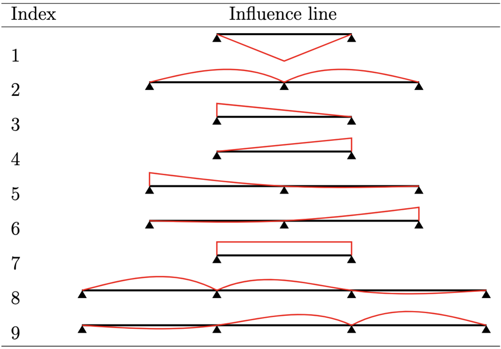
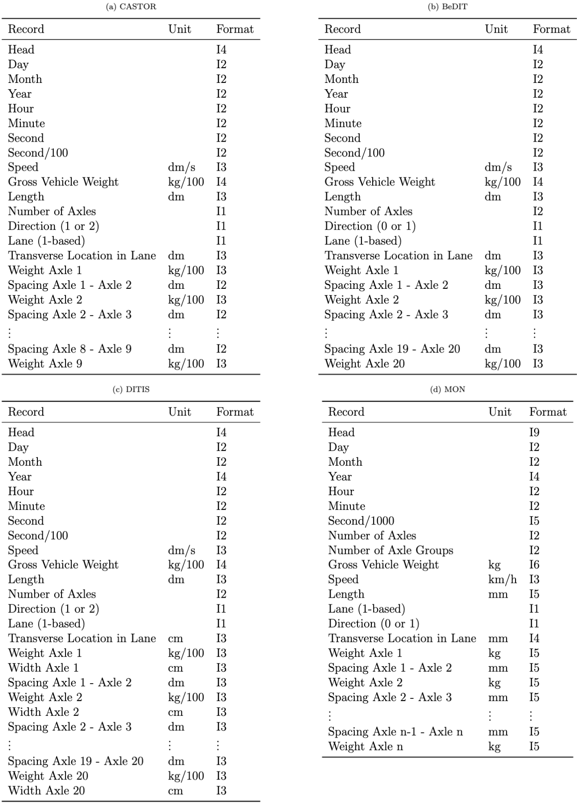

**********
IO Formats
**********

This section gives the commonly used input and output format information for *PyBTLS*. 
Note that the information is also included in the docstrings of relevant classes and functions or the BTLS manual. 

Built-in influence line map
---------------------------

Traffic file format
-------------------

