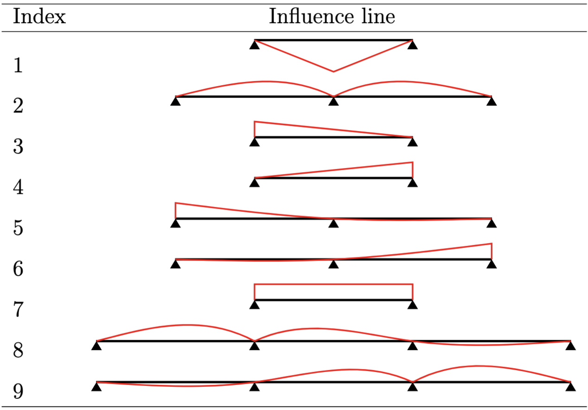
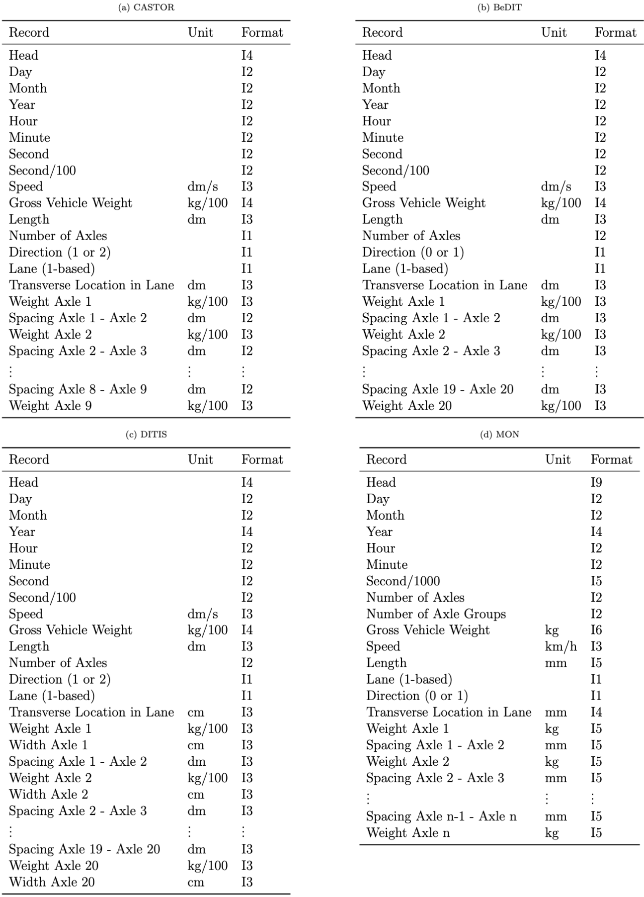

**********
IO Formats
**********

This section gives the commonly used input and output format information for *PyBTLS*. 
Note that the information is also included in the docstrings of relevant classes and functions or the BTLS manual. 

Built-in influence line map
---------------------------

Traffic file format
-------------------
PyBTLS traffic/garage input formats are identified by the following format IDs:

1. CASTOR fixed-width format
2. BeDIT fixed-width format
3. DITIS fixed-width format
4. MON fixed-width format
5. SiWIM header-based CSV export format

MON remains the recommended compact simulation exchange format. SiWIM support is
input-only and allows detailed SiWIM CSV exports to be read directly without a
lossy preprocessing conversion step.

Rainflow residual sidecar (FRR_*.txt)
-------------------------------------
Written only by chunked simulations (or when
``set_fatigue_output(write_residuals=True)``): one file per load effect
named ``FRR_{bridge_length}_{effect}.txt``. The first line holds the
rainflow binning parameters (``decimal`` and ``cutoff``, tab-separated);
each following line is one unclosed residual reversal value at full
double precision. PyBTLS uses these to splice the rainflow histograms
of consecutive chunks together exactly; they are not meant to be read
directly.
