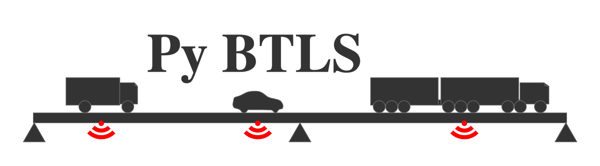

|Code style: black|
|License: GPLv3|
.. |version|
|Github issues|
|Github pull requests|
|PyPI|
..    |GitHub Workflow Deploy|
..    |GitHub Workflow Build|
..    |GitHub Workflow Status|
..    |GitHub commit activity|
..    |GitHub last commit|
..    |Contributor Covenant|
|codecov|

.. |Code style: black| image:: https://img.shields.io/badge/code%20style-black-000000.svg 
   :target: https://github.com/psf/black

.. |License: GPLv3| image:: https://img.shields.io/badge/License-GPLv3-yellow 
   :target: https://opensource.org/license/gpl-3-0/

.. 
   |version| image:: https://img.shields.io/github/downloads/ccaprani/btls/total?label=version

.. |GitHub issues| image:: https://img.shields.io/github/issues/ccaprani/btls?logoColor=yellowgreen

.. |GitHub pull requests| image:: https://img.shields.io/github/issues-pr/ccaprani/btls?color=yellowgreen

.. |PyPI| image:: https://img.shields.io/pypi/v/btls

.. |GitHub Workflow Deploy| image:: https://img.shields.io/github/workflow/status/ccaprani/btls/Build%20and%20deploy

.. |GitHub Workflow Build| image:: https://img.shields.io/github/workflow/status/ccaprani/btls/Deploy%20to%20GitHub%20Pages?label=gh%20page%20build

.. |GitHub Workflow Status| image:: https://img.shields.io/github/workflow/status/ccaprani/btls/Tests?label=Tests

.. |GitHub commit activity| image:: https://img.shields.io/github/commit-activity/m/ccaprani/btls

.. |GitHub last commit| image:: https://img.shields.io/github/last-commit/ccaprani/btls?color=ff69b4

.. |Contributor Covenant| image:: https://img.shields.io/badge/Contributor%20Covenant-2.1-4baaaa.svg 
   :target: code_of_conduct.md

.. |codecov| image:: https://codecov.io/gh/ccaprani/btls/branch/main/graph/badge.svg?token=dUTOmPBnyP 
   :target: https://codecov.io/gh/ccaprani/btls

Welcome to PyBTLS's documentation!
==================================

`PyBTLS` is a python wrapper of the C++ based program bridge traffic load simulation (BTLS). 
It is tailored for traffic simulations on short-to-medium length bridges, where vehicles' lane-changing behaviors are considered negligible.

`PyBTLS` uses influence lines or surfaces to calculate the load effects on bridges. 
It integrates several built-in influence lines (FIGURE), and more influence lines or surfaces can be defined by users. 

The program features:

- Pre-processing of WIM data (e.g., classifying vehicles, filtering traffic, etc.); 
- Conducting traffic simulation (e.g., load effects calculation, traffic generation, etc.);
- Post-processing of the simulation outcomes (e.g., block-maximum analysis, peak-over-threshold analysis, rainflow analysis, etc.). 

.. toctree::
   :maxdepth: 2
   :caption: Contents:

   installation
   general
   tutorials
   api
   theory
..
   inf_lines 
   bridges
   ModuleDoc
   ChangeLog

Related Packages
================
- `pycba <https://github.com/ccaprani/pycba/>`_ is a python implementation of the Continuous Beam Analysis program, originally coded in Matlab and subsequently ported to C++ (by Pierrot).
- `ospgrillage <https://github.com/ccaprani/ospgrillage>`_ is a bridge deck grillage analysis package which is a pre-processor for `OpenSeesPy <https://github.com/zhuminjie/OpenSeesPy>`_, a python wrapper for the general finite element analysis framework `OpenSees <https://github.com/OpenSees/OpenSees>`_.

Indices and tables
==================

* :ref:`genindex`
* :ref:`modindex`
* :ref:`search`
