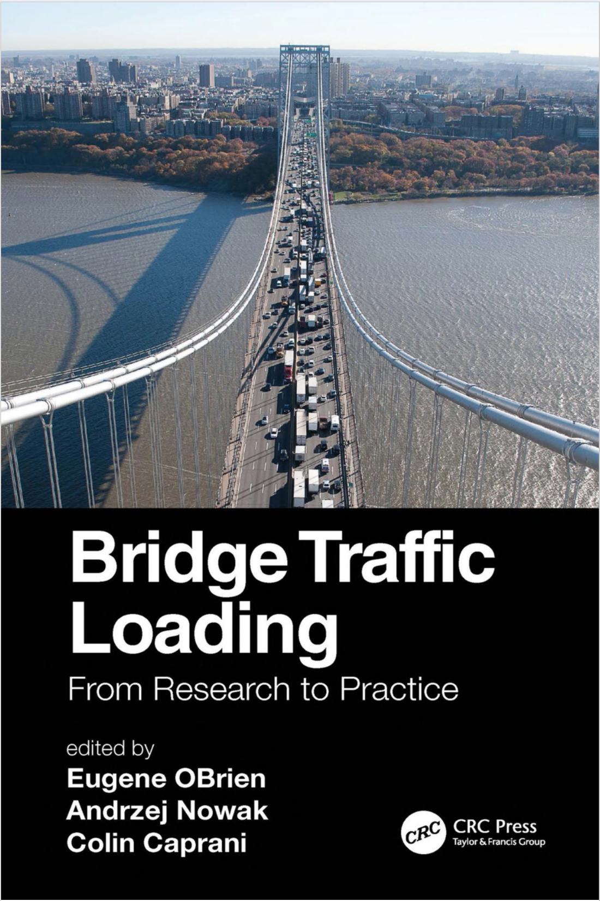

**********************
Theoretical Background
**********************

PyBTLS is grounded in Chapter 3 of the key reference book below, which forms the basis for the simulation strategies implemented in *PyBTLS*. 

What does the chapter explain?
------------------------------
- Traffic data
- Loading events
- Load effects
- Dynamic interaction
- Statistical prediction
- Notional load models

What does the book cover?
-------------------------
- A brief but comprehensive overview for the contemporary bridge design and assessment under traffic loading
- A specific focus on the short-to-medium span bridges
- The effect of dynamic loading from road traffic
- A specific focus on the long span bridges
- Factors affecting the accuracy of characteristic maximum load effects

