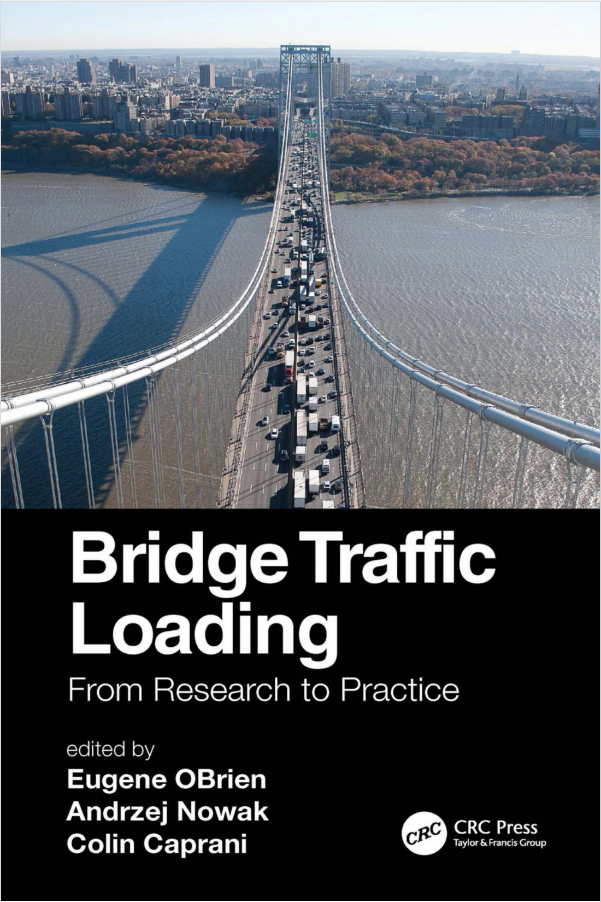

**********************
Theoretical Background
**********************

PyBTLS is grounded in Chapter 3 of the key reference book below, which forms the basis for the simulation strategies implemented in *PyBTLS*. 

What does the chapter explain?
------------------------------
- Traffic data
- Loading events
- Load effects
- Dynamic interaction
- Statistical prediction
- Notional load models

What does the book cover?
-------------------------
- A brief but comprehensive overview for the contemporary bridge design and assessment under traffic loading
- A specific focus on the short-to-medium span bridges
- The effect of dynamic loading from road traffic
- A specific focus on the long span bridges
- Factors affecting the accuracy of characteristic maximum load effects

Load effect modes: centrifugal force
------------------------------------

.. warning::

   Experimental. This mode has not been checked against a reference
   solution, and its sign convention may change in a future release.

Besides the ordinary vertical reaction, an influence line can be switched
to a horizontal-force mode via ``InfluenceLine.set_mode()``:

- **Vertical** (default): the per-axle force is the axle weight,
  :math:`F = W_{axle}`.
- **Centrifugal**: :math:`F = W_{axle} \, v^2 / g`, with each vehicle's
  own speed :math:`v`. The bridge geometry constants — the superelevation
  factor :math:`k_e` and the curve radius :math:`1/R` — are *not* applied
  in the kernel; bake them into the influence ordinates so the convolved
  effect is a force in kN. For an influence line the per-effect
  ``inf_weight`` may carry them instead; an influence surface ignores
  ``inf_weight``, so there the constants must go into the surface
  ordinates themselves. The force is unsigned: it points to the outside
  of the curve for both directions of travel.

The mode only changes the per-axle force entering the influence-line
convolution; event detection, extreme-value statistics, and all output
formats behave exactly as in the vertical case.
